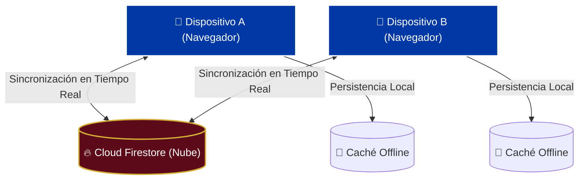

# 🏆 FIBUS 2026 — Álbum de Figuritas Compartido en Tiempo Real

> Una aplicación web minimalista, reactiva y de diseño deportivo premium creada para que **parejas** coordinen, registren y completen el álbum oficial del **Mundial 2026** de forma conjunta y sincronizada al instante.

---

## 🌟 Características Clave

Fibus 2026 se enfoca al 100% en la experiencia de coleccionar de a dos, proporcionando herramientas directas y fluidas para el día a día:

### 👥 Álbum Único Compartido
*   **Inventario Unificado:** Ambos registran en la misma base de datos. Si uno marca una figurita como obtenida o agrega una repetida, la información se actualiza automáticamente en las pantallas de ambos teléfonos.
*   **Control del Progreso Común:** Un panel visual superior muestra el porcentaje exacto de completitud general y el conteo de figuritas faltantes y repetidas que tienen juntos.

### ⚡ Sincronización Reactiva Instantánea (Sub-100ms)
*   **Firestore Real-time & Update Granular:** Utiliza Cloud Firestore de Firebase con actualizaciones de rutas anidadas (ej. `stickers.ARG10`) para realizar actualizaciones parciales en la nube en milisegundos, minimizando el consumo de datos y la latencia.
*   **Sala de Sincronización:** Mediante un simple código de sala en el footer, asocia el navegador web a una base de datos específica de forma discreta y sin flujos complejos de registro.
*   **Optimización Móvil (Reconexión al Enfoque):** Listeners inteligentes de red (`online`/`offline`) y estado de pestaña (`visibilitychange`) fuerzan una reconexión fresca de Firestore en cuanto el usuario retoma el navegador o enciende la pantalla del celular.

### 🎨 Diseño Deportivo Premium (Estilo Álbum Físico Panini)
*   **Estética Auténtica:** Paleta de colores basada en papel crema/marfil (`#F9F7F3`), Burgundy/Guinda clásico del mundial (`#5E0B19`) y acentos en Oro/Dorado (`#D4AF37`).
*   **Tipografía Curada:** Combinación deportiva con `Montserrat` para títulos, `Bebas Neue` para códigos/números/progreso e `Inter` para textos de lectura.
*   **Borders Temáticos por Selección:** Cada selección incluye bandas con degradados de los colores de su bandera y un fondo abstracto decorado con curvas nacionales suaves (`radial-gradient`).

### 🕹️ Gestos Táctiles con Respuesta Háptica
Optimizado especialmente para pantallas móviles de celulares:
*   **Toque Corto (Single Tap):** Si no la tienes, se marca como obtenida (fondo verde). Si ya la tienes, suma una repetida (badge de cantidad y fondo oro).
*   **Presión Prolongada (Long Press de 500ms):** Resta una copia repetida. Si llega a 0, se desmarca por completo. Emite una sutil vibración táctil de **50ms** (`navigator.vibrate`).
*   **Doble Tap:** Agrega o quita la figurita de tus **Favoritas**. Emite una vibración táctil de **35ms**.
*   **Gestos Aislados:** Toda la gesticulación intercepta la propagación de eventos (`e.stopPropagation()`) para prevenir clicks accidentales durante el scroll.

### ⭐ Sistema de Favoritas
*   **Destacado Limpio:** Las figuritas favoritas se diferencian mediante un marco de doble borde dorado de alta visibilidad (`border-2 border-amber-500 shadow-md shadow-amber-500/25`), eliminando botones flotantes para evitar solapamientos de texto.
*   **Filtro dedicado:** Puedes aislar y visualizar tus preferidas con la opción "Favoritas" en los filtros de estado.

### 🔍 Buscador, Vistas y Estilos de Tarjeta
*   **Buscador Inteligente:** Filtra instantáneamente por código o país, ocultando acordeones vacíos para limpiar la pantalla.
*   **Filtros de Estado (Izquierda):** Todas, Faltantes, Obtenidas, Repetidas y Favoritas.
*   **Modos de Visualización (Centro):**
    *   *Álbum:* Estructura clásica con acordeones (Sedes, Países, Historia, Coca-Cola).
    *   *Equipos:* flat list de las 48 selecciones directamente, omitiendo categorías especiales.
    *   *Especiales:* Oculta selecciones y se concentra en emblemas e historia.
    *   *Continua:* Grilla plana sin acordeones ni divisiones.
*   **Selector de Estilo de Tarjeta (Derecha):**
    *   *Código/Nombre (default):* Muestra código y nombre del jugador.
    *   *Solo Código:* Oculta el nombre para un estilo minimalista.
    *   *Solo Nombre:* Oculta el código y destaca el nombre del jugador en el centro (`uppercase tracking-tight`), con fallback automático a código para cromos sin nombre.
*   **Atajos Interactivos:**
    *   Click en panel de progreso: Restablece todos los filtros por defecto.
    *   Click en badge global de repetidas: Activa filtro "Repetidas" y vista "Continua".

---

## 🏗️ Flujo de Sincronización

---

## 🛠️ Stack Tecnológico

El proyecto está cimentado sobre tecnologías de vanguardia enfocadas en rendimiento óptimo e interactividad fluida:

*   **Biblioteca UI:** `React 19` (Renderizado reactivo eficiente).
*   **Entorno de Construcción:** `Vite 8` (Compilación rápida para web).
*   **Estilos:** `Tailwind CSS v4` (Diseño responsivo, tipografías y transiciones).
*   **Base de Datos Cloud:** `Firebase Cloud Firestore` (Suscripciones reactivas y WebSockets).
*   **Base de Datos Estática:** `JSON Catalogs` (Catálogo depurado de **994 figuritas** del álbum oficial con nombres de jugadores e historiales de FWC).

---

  <i>FIBUS 2026 • Creado con ⚽ para hacer del coleccionismo una aventura de a dos.</i>

