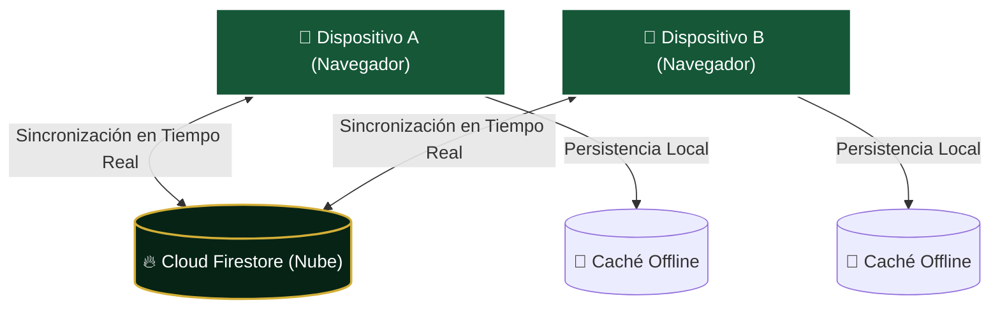

# 🏆 FIBUS 2026 — Álbum de Figuritas Compartido en Tiempo Real

> Una aplicación web minimalista, reactiva y de diseño premium creada para que **parejas** coordinen, registren y completen el álbum del **Mundial 2026** de forma conjunta y sincronizada al instante.

---

## 🌟 Características Clave

Fibus 2026 se enfoca al 100% en la experiencia de coleccionar de a dos, proporcionando herramientas directas y fluidas para el día a día:

### 👥 Álbum Único Compartido
*   **Inventario Unificado:** Ambos registran en la misma base de datos. Si uno marca una figurita como obtenida o agrega una repetida, la información se actualiza automáticamente en las pantallas de ambos teléfonos.
*   **Control del Progreso Común:** Un panel visual superior muestra el porcentaje exacto de completitud general y el conteo de figuritas faltantes y repetidas que tienen juntos.

### ⚡ Sincronización Reactiva Instantánea
*   **Firestore Real-time:** Utiliza Cloud Firestore de Firebase para establecer suscripciones de datos en vivo. No se requiere recargar la página; las actualizaciones aparecen instantáneamente cuando se detecta un cambio.
*   **Sala Privada de Sincronización:** Mediante un simple código de sala en la cabecera, se asocia el navegador web a una base de datos específica de forma discreta y sin flujos complejos de registro.

### 📶 Soporte Offline Nativo
*   **Caché Persistente:** Diseñado para funcionar en estadios, eventos de intercambio o zonas sin internet. Todos los cambios se guardan localmente en la caché del navegador y se sincronizan con la nube tan pronto como se recupere la señal.

### 🔍 Buscador y Filtros Inteligentes
*   **Búsqueda Rápida:** Filtra instantáneamente por código de figurita (ej. `ARG10`, `FWC04`) o país.
*   **Filtros de Estado:** Visualiza rápidamente solo las figuritas "Faltantes" (para saber qué buscar en los intercambios), "Tenemos" o "Repetidas".
*   **Agrupación Estructural:** Figuritas ordenadas por secciones (Sedes, Especiales y de los Grupos A al L) en prácticos paneles colapsables.

---

## 🏗️ Flujo de Sincronización

---

## 🛠️ Stack Tecnológico

El proyecto está cimentado sobre tecnologías de vanguardia enfocadas en rendimiento óptimo e interactividad fluida:

*   **Biblioteca UI:** `React 19` (Renderizado reactivo eficiente).
*   **Entorno de Construcción:** `Vite 8` (Compilación rápida para web).
*   **Estilos:** `Tailwind CSS v4` (Diseño glassmorphism responsivo y transiciones).
*   **Base de Datos Cloud:** `Firebase Cloud Firestore` (Suscripciones reactivas y WebSockets).
*   **Persistencia Local:** `Firestore Offline Cache` (Almacenamiento persistente en IndexedDB).
*   **Base de Datos Estática:** `JSON Catalogs` (Catálogo depurado de **994 figuritas** del álbum oficial).

---

  <i>FIBUS 2026 • Creado con 💚 para hacer del coleccionismo una aventura de a dos.</i>

