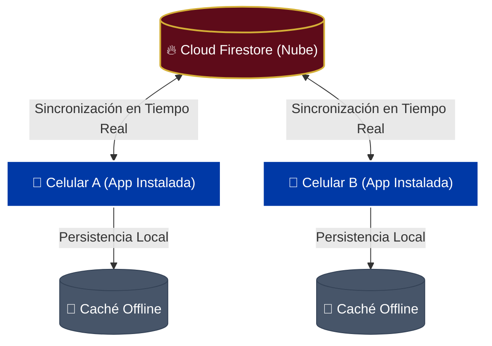

# 🏆 Mis Fibus — Álbum de Figuritas Compartido en Tiempo Real

> Una aplicación web progresiva (PWA) minimalista, reactiva y de diseño deportivo premium creada para que puedas coordinar, registrar y completar el álbum oficial del **Mundial 2026** de forma conjunta y sincronizada al instante, directamente desde tu celular.

---

## 🌟 Características Clave

Mis Fibus se enfoca al 100% en la experiencia de coleccionar de a dos, proporcionando herramientas directas y fluidas para el día a día:

### 👥 Álbum Único Compartido

- **Inventario Unificado:** Ambos registran en la misma base de datos en la nube. Si uno marca una figurita como obtenida o agrega una repetida, la información se actualiza automáticamente en las pantallas de ambos teléfonos.
- **Control del Progreso Común:** Un panel visual superior muestra el porcentaje exacto de completitud general y el conteo de figuritas faltantes y repetidas que tienen juntos.

### 📱 Experiencia Nativa (PWA Instalable)

- **Detección Inteligente de OS:** Si entrás desde un navegador móvil, la app detecta automáticamente si estás en iOS (Safari) o Android (Chrome) y te despliega instrucciones visuales personalizadas paso a paso para instalarla.
- **Standalone App:** Diseñada para instalarse en la pantalla de inicio del celular. Funciona sin bordes de navegador, lanza a pantalla completa y con íconos de alta calidad, brindando una experiencia 100% nativa.
- **Reconexión Inteligente:** Listeners de red (`online`/`offline`) y estado de pestaña (`visibilitychange`) fuerzan una reconexión de Firestore en cuanto retomás la app o encendés la pantalla del celular.
- **Animaciones y Transiciones Fluidas:** Los modales de ayuda e instalación se abren y cierran con efectos de desvanecimiento y escalado (`fade`/`scale`) suaves. Además, los acordeones colapsables de selecciones y grupos de figuritas transicionan su altura dinámicamente sin saltos bruscos.

### ⚡ Sincronización Reactiva Instantánea (Sub-100ms)

- **Firestore Real-time & Update Granular:** Utiliza Cloud Firestore de Firebase con actualizaciones de rutas anidadas (ej. `stickers.ARG10`) para realizar actualizaciones parciales en la nube en milisegundos.
- **Sincronización de Salas:** Mediante un parámetro en la URL o un código de sala en las configuraciones, asociás la app a una base de datos específica. El código de tu sala queda guardado en tu teléfono de forma persistentemente.

### 🎨 Diseño Deportivo Premium

- **Estética Auténtica:** Paleta de colores basada en papel crema/marfil (`#F9F7F3`), acentos azules (`#a9ced6`, `#3e3aaa`), y toques en Oro/Dorado para elementos premium (`#D4AF37`). Minimalismo adaptado con tonos grises de Apple (`#475569`) para mayor elegancia.
- **Tipografía Curada:** Combinación deportiva con `Montserrat` para títulos, `Bebas Neue` para códigos/progreso e `Inter` para textos de lectura.
- **Fondos Nacionales Dinámicos:** Cada selección despliega bandas con los colores exactos y proporcionales de su bandera en un fondo abstracto de curvas.

### 🕹️ Gestos Táctiles con Respuesta Háptica

Optimizado especialmente para pantallas táctiles con feedback de vibración (`navigator.vibrate`):

- **Toque Corto (1 Click):** Si no la tenés, se marca como obtenida. Si ya la tenés, le suma una repetida (badge indicador `x2`).
- **Presión Prolongada (1 Segundo):** Resta una copia repetida. Si llega a 0, se desmarca por completo. Emite vibración táctil (50ms).
- **Doble Toque (Double Tap):** Agrega o quita la figurita de tus **Favoritas**. Emite vibración táctil (35ms).

### ⭐ Sistema de Favoritas, Repetidas y Faltantes

- **Destacado de Favoritas:** Las figuritas preferidas se diferencian mediante un marco de doble borde dorado de alta visibilidad, sin botones superpuestos.
- **Compartir Repetidas:** Al filtrar por "Repetidas" o "Faltantes", tenés la opción de compilar tus duplicados agrupados con banderas, emojis y formato oficial del álbum con multiplicadores para enviarlos por redes (Web Share API) o copiarlos.
- **Compartir Faltantes:** Un botón dedicado compila y comparte tus figuritas pendientes agrupadas y formateadas con emojis en el mismo orden del álbum.
- **Disposición Lado a Lado:** Ambos botones se muestran lado a lado en un diseño responsivo de dos columnas cuando cualquiera de estos dos filtros de estado se encuentra activo.

### 🔍 Buscador y Vistas Personalizables

- **Buscador Inteligente:** Filtrá instantáneamente por código o país.
- **Filtros de Estado:** Todas, Faltantes, Obtenidas, Repetidas y Favoritas.
- **Modos de Visualización:**
  - _Álbum:_ Acordeones por selecciones y grupos.
  - _Equipos:_ Lista directa de los 48 países.
  - _Especiales:_ Sólo escudos, historia y especiales.
  - _Continua:_ Grilla plana sin divisiones.
- **Estilo de Tarjeta:** Elegí entre ver Código y Nombre, Solo Código, o Solo Nombre.
- **Atajos Interactivos:**
  - Tocá el porcentaje de progreso para limpiar los filtros.
  - Tocá la cantidad global de repetidas para filtrarlas al instante.
  - Tocá el logo superior de "MIS FIBUS" para volver arriba de todo automáticamente.

---

## 🏗️ Flujo de Sincronización

---

## 🛠️ Stack Tecnológico

El proyecto está cimentado sobre tecnologías de vanguardia enfocadas en rendimiento móvil e interactividad fluida:

- **Biblioteca UI:** `React 19` (Renderizado reactivo eficiente).
- **Entorno de Construcción:** `Vite 8` (PWA y Compilación ultrarrápida).
- **Estilos:** `Tailwind CSS v4` (Diseño responsivo, variables CSS y utilidades modernas).
- **Base de Datos Cloud:** `Firebase Cloud Firestore` y `Firebase Hosting` (Suscripciones reactivas y caché inmutable).
- **Iconografía:** `react-icons` (Iconos vectoriales limpios y escalables).
- **Arquitectura de Datos:** Hooks personalizados de React (`useShareDuplicates`, `useShareMissing`, `useSharedAlbum`, etc.) para separar rigurosamente la lógica de datos y negocio del renderizado de componentes.

---

  <i>Mis Fibus • Creado para hacer del coleccionismo una aventura de a dos.</i>

